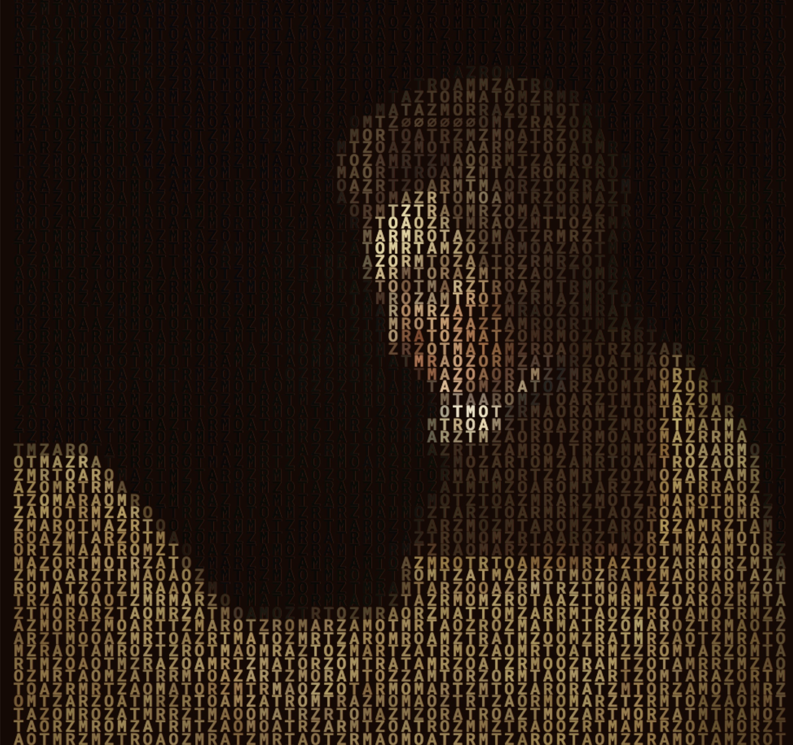

# openmozart.cthiebaud.com

In memoriam openmozart.net 2001* - 2005†. 

## The Pitch

719 permutations of the name "MOZART" colored in such a way as to form the famous portrait by [Joseph Lange](https://en.wikipedia.org/wiki/Joseph_Lange).

Permutations are randomly sorted; the order changes with each refresh of the page.

According to [Factorial Calculator](https://www.calculatorsoup.com/calculators/discretemathematics/factorials.php), there are \~= 2.6 E+1746 (!720) 
possible orderings of (719 + 1) permutations. That's a lot. Much, much more than the atoms in the observable universe (\~[1.0 E83](https://www.universetoday.com/36302/atoms-in-the-universe/))

The name "MOZART" itself (kind of identity permutation) is replaced by "∅∅∅∅∅∅" 

However, since the permutations are sorted randomly, the name "MOZART" can still appear through the collision of two other permutations: e.g. "TAR·MOZ", then "ART·ZOM".

Furthermore, "MOZART" may appear vertically.

People who really have nothing else to do can have fun trying to find the happy collisions and the vertical coincidences.

Already tedious in itself, this unglamorous task is made even more difficult by 3 obstacles:

1. if the length/width ratio of the screen is not that of the original image, some parts are not even visible,

2. a large number of almost black letters on a dark brown background are illegible, and

3. there is no guarantee that a collision or a vertical alignment exists in the current page.

## Tips and Tricks

### On a Browser

* Clicking anywhere sets a new random order for the permutations.
* Pressing 'Enter' starts a slideshow that reorders every 2 seconds.
* Pressing 'Spacebar' stops the slideshow when it is running; otherwise, it sets a new random order.
* Typing 'cheat' reveals the happy collision(s) and the undreamed-of vertical coincidence(s), if any.
* Pressing 'Escape' stops cheating.

### On a Mobile Phone

* Tap: sets a new random order for the permutations.
* Horizontal swipe: toggles slideshow.
* Long press (also known as 'press and hold'): toggles cheating.

## Botched Philosophy

The probability that a sorting of these (719 + 1) anagrams forms an image immediately identifiable as being the famous portrait of Mozart by Joseph Lange is thus of the order of 2.6 E1740 (!720 divided by some billions of billions (guess work) of neighbouring combinations).

I have no idea what the probability is that a genius like Mozart could have existed, but I like to think it is of a similar order of magnitude.

*The image below contains 5 times MOZART (3 times horizontally and 2 times vertically), of which 4 are clearly readable (the 5th, vertical, is in the dark). The jpeg to cheat is in the directory.*

